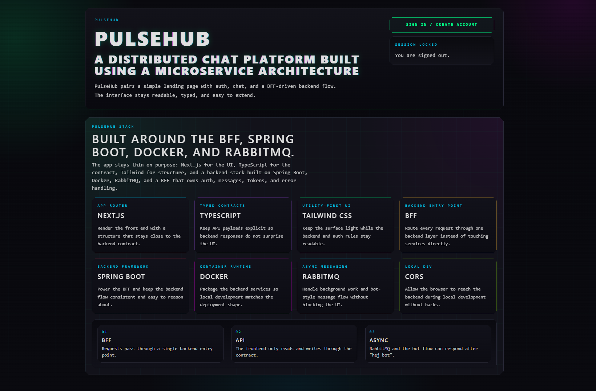

# PulseHub Backend

PulseHub är en distribuerad chattapplikation byggd för Laboration 2 Microservices.
Backend-repot innehåller flera Spring Boot-microservices i en Maven-reactor och kan startas som en komplett lokal backend-miljö med Docker Compose.

Frontend ska senare bara prata med `bff-service`. BFF ansvarar för JWT-validering och vidarebefordrar anrop till interna services.

## Screenshot



## Arkitektur

```text
Client / Frontend
  -> bff-service
      -> auth-service
      -> user-service
      -> message-service
           -> PostgreSQL
           -> RabbitMQ message-published
                -> bot-service
                     -> message-service
```

Huvudflödet för meddelanden:

1. Klienten skickar `POST /api/messages` till BFF.
2. BFF validerar JWT och läser `userId` + `username`.
3. BFF skickar meddelandet till `message-service`.
4. `message-service` hämtar avsändarprofilen från `user-service` via gRPC.
5. `message-service` sparar meddelandet i PostgreSQL med username från `user-service`.
6. `message-service` publicerar eventet `message-published` till RabbitMQ.
7. `bot-service` konsumerar eventet.
8. Om innehållet triggar botten, skickar `bot-service` ett svar till `message-service`.
9. `message-service` sparar svaret.

Mer detaljer finns i:

- [docs/architecture.md](docs/architecture.md)
- [docs/docker-compose.md](docs/docker-compose.md)
- [docs/test-flow.md](docs/test-flow.md)
- [docs/health-checks.md](docs/health-checks.md)

## Services

| Service           | Ansvar                                                                        |
|-------------------|-------------------------------------------------------------------------------|
| `bff-service`     | Frontendens enda ingång. Validerar JWT och anropar interna services via REST. |
| `auth-service`    | Registrering, inloggning, BCrypt-hashning och JWT-generering.                 |
| `user-service`    | Hanterar användarprofiler.                                                    |
| `message-service` | Skapar/hämtar chattmeddelanden och publicerar RabbitMQ-event.                 |
| `bot-service`     | Konsumerar `message-published` och skapar enkla PulseBot-svar.                |

## Teknikstack

- Java 25
- Spring Boot 4
- Maven Wrapper
- Spring Web MVC
- Spring Data JPA / Hibernate
- PostgreSQL
- RabbitMQ / Spring AMQP
- Spring Boot Actuator
- Docker Compose
- JUnit / Mockito

## Portar

| Komponent              | Host-port | Intern Docker-port |
|------------------------|-----------|--------------------|
| BFF                    | `8080`    | `8080`             |
| User Service           | `8081`    | `8081`             |
| Auth Service           | `8082`    | `8082`             |
| Message Service        | `8083`    | `8083`             |
| Bot Service            | `8084`    | `8084`             |
| User Service gRPC      | `9091`    | `9091`             |
| RabbitMQ AMQP          | `5672`    | `5672`             |
| RabbitMQ Management UI | `15672`   | `15672`            |
| User DB                | `5433`    | `5432`             |
| Auth DB                | `5434`    | `5432`             |
| Message DB             | `5435`    | `5432`             |

Actuator health finns på varje service:

```text
http://localhost:8080/actuator/health
http://localhost:8081/actuator/health
http://localhost:8082/actuator/health
http://localhost:8083/actuator/health
http://localhost:8084/actuator/health
```

## Databaser

Docker Compose startar separata PostgreSQL-containers:

| Compose service | Databas             | Ägare             |
|-----------------|---------------------|-------------------|
| `auth-db`       | `pulsehub_auth`     | `auth-service`    |
| `user-db`       | `pulsehub_users`    | `user-service`    |
| `message-db`    | `pulsehub_messages` | `message-service` |

Lokala labb-credentials:

```text
Username: pulsehub
Password: pulsehub
```

Services delar inte databastabeller. Varje persistent service äger sin egen databas.

## RabbitMQ

RabbitMQ körs som Compose service `rabbitmq`.

```text
AMQP: http://localhost:5672
Management UI: http://localhost:15672
Login: guest / guest
```

Message-event:

```text
Exchange: pulsehub.messages
Routing key: message.published
Queue: pulsehub.message-published
Event type: message-published
```

`message-service` publicerar `message-published` efter att ett meddelande sparats.
`bot-service` konsumerar eventet från `pulsehub.message-published`.

## gRPC

`user-service` exponerar gRPC på port `9091`.

Proto-filen finns här:

```text
proto/user.proto
```

Den definierar:

```text
UserGrpcService/GetUserById
```

`message-service` anropar `user-service` via gRPC innan ett meddelande sparas.
Om användaren finns används `username` från `user-service`.
`username` från message-requesten är frivilligt och används inte som källa till sanning.
Om användaren inte finns returnerar `message-service` `404`.
Om gRPC/user-service inte går att nå returnerar `message-service` `503`.

## Starta Allt

Krav:

- Docker Desktop
- Java 25 om du även vill köra Maven lokalt

Starta hela backend-miljön:

```powershell
docker compose up --build
```

Starta i bakgrunden:

```powershell
docker compose up --build -d
```

Visa status:

```powershell
docker compose ps
```

Följ logs:

```powershell
docker compose logs -f
```

Följ en specifik service:

```powershell
docker compose logs -f bot-service
```

## Testa Systemet

Alla klientanrop ska gå via BFF på `http://localhost:8080`.

PowerShell 5 kan skicka svenska tecken fel om JSON inte skickas som UTF-8 bytes. Exemplen nedan använder därför explicit UTF-8.

### 1. Health Checks

```powershell
Invoke-RestMethod http://localhost:8080/actuator/health
Invoke-RestMethod http://localhost:8081/actuator/health
Invoke-RestMethod http://localhost:8082/actuator/health
Invoke-RestMethod http://localhost:8083/actuator/health
Invoke-RestMethod http://localhost:8084/actuator/health
```

Förväntat:

```json
{ "status": "UP" }
```

### 2. Register

```powershell
$registerBody = @{
  username = "milla"
  displayName = "Milla"
  password = "password123"
} | ConvertTo-Json

$register = Invoke-RestMethod `
  -Uri http://localhost:8080/api/auth/register `
  -Method Post `
  -ContentType "application/json; charset=utf-8" `
  -Body ([System.Text.Encoding]::UTF8.GetBytes($registerBody))
```

Förväntat: `userId`, `username` och `displayName`. Token returneras först vid login.

BFF skapar först auth-kontot i `auth-service` och skapar sedan profilen i `user-service` med samma `userId`.

Kontrollera profilen i `user-service`:

```powershell
Invoke-RestMethod "http://localhost:8081/users/$($register.userId)"
```

Om `user-service` misslyckas efter att auth-kontot skapats returnerar BFF `502 Registration profile creation failed`. Det kan lämna ett partiellt skapat konto i `auth-service`.

### 3. Login

```powershell
$loginBody = @{
  username = "milla"
  password = "password123"
} | ConvertTo-Json

$login = Invoke-RestMethod `
  -Uri http://localhost:8080/api/auth/login `
  -Method Post `
  -ContentType "application/json; charset=utf-8" `
  -Body ([System.Text.Encoding]::UTF8.GetBytes($loginBody))
```

Token finns i:

```powershell
$login.token
```

### 4. /api/me

```powershell
Invoke-RestMethod `
  -Uri http://localhost:8080/api/me `
  -Headers @{ Authorization = "Bearer $($login.token)" }
```

Förväntat:

```json
{
  "userId": "uuid",
  "username": "milla"
}
```

### 5. Skicka Meddelande Och Trigga PulseBot

Klienten skickar bara `channel` och `content`. BFF fyller själv i `senderId` och kan tills vidare skicka `username` från JWT, men `message-service` ignorerar requestens `username` och hämtar korrekt username från `user-service` via gRPC.

```powershell
$messageBody = @{
  channel = "general"
  content = "hej bot"
} | ConvertTo-Json

Invoke-WebRequest -UseBasicParsing `
  -Uri http://localhost:8080/api/messages `
  -Method Post `
  -ContentType "application/json; charset=utf-8" `
  -Headers @{ Authorization = "Bearer $($login.token)" } `
  -Body ([System.Text.Encoding]::UTF8.GetBytes($messageBody))
```

Eftersom botflödet går via RabbitMQ kan du behöva vänta någon sekund:

```powershell
Start-Sleep -Seconds 1
```

### 6. Hämta Meddelanden

```powershell
Invoke-RestMethod `
  -Uri "http://localhost:8080/api/messages?channel=general" `
  -Headers @{ Authorization = "Bearer $($login.token)" }
```

Förväntat: minst två meddelanden:

```text
username: milla
content: hej bot

username: PulseBot
content: Hej! Jag är PulseBot. Testa att skriva /help.
```

Bot-loop undviks genom att `bot-service` ignorerar events där `username` är `PulseBot`.

## Stoppa Och Rensa

Stoppa containers men behåll databaser:

```powershell
docker compose down
```

Stoppa och ta bort databaser/volumes:

```powershell
docker compose down -v
```

Ta även bort lokalt byggda images:

```powershell
docker compose down -v --rmi local
```

## Vanliga Fel

**Port already allocated**  
Något kör redan på `8080-8084`, `5433-5435`, `5672` eller `15672`. Stoppa den lokala processen eller ändra port mapping i `docker-compose.yml`.

**BFF returnerar 401**  
Token saknas, är felaktig eller har gått ut. Logga in igen och använd:

```text
Authorization: Bearer <token>
```

**JWT fungerar i auth men inte i BFF**  
`JWT_SECRET` måste vara samma i `auth-service` och `bff-service`.

**Message-service returnerar 503 vid POST /messages**  
RabbitMQ är troligen inte redo eller inte nåbar. Kontrollera:

```powershell
docker compose ps rabbitmq
docker compose logs rabbitmq
```

**Databasfel vid startup**  
Kontrollera att rätt DB-container är healthy:

```powershell
docker compose ps
docker compose logs auth-db
docker compose logs user-db
docker compose logs message-db
```

**Fel interna hostnames**  
Inne i containers ska services inte använda `localhost` för att prata med varandra. Använd Compose service names:

```text
auth-service
user-service
message-service
rabbitmq
auth-db
user-db
message-db
```

gRPC från `message-service` till `user-service` använder:

```text
user-service:9091
```

## Lokal Maven-test

Kör alla tester:

```powershell
.\mvnw.cmd -B test
```

Linux/macOS:

```bash
./mvnw -B test
```

## Smoke Test

Efter att Docker Compose har startat backend kan du köra ett snabbt end-to-end-test:

```powershell
.\scripts\smoke-test.ps1
```

Skriptet kontrollerar health endpoints, registrerar en ny användare via BFF, verifierar profilen i `user-service`, loggar in, anropar `/api/me`, skickar meddelande och kontrollerar att PulseBot svarar.

## CI

GitHub Actions kör hela Maven-reactorn och startar PostgreSQL + RabbitMQ för testmiljön.

Moduler:

- `auth-service`
- `bff-service`
- `bot-service`
- `message-service`
- `user-service`

## Nästa Steg

Nästa rimliga små steg:

- förbättra felhantering/retry runt RabbitMQ-publicering
- lägga till en outbox-lösning för säkrare event-publicering
- senare bygga frontend som bara pratar med BFF

Inte byggt ännu:

- frontend
- Kubernetes
